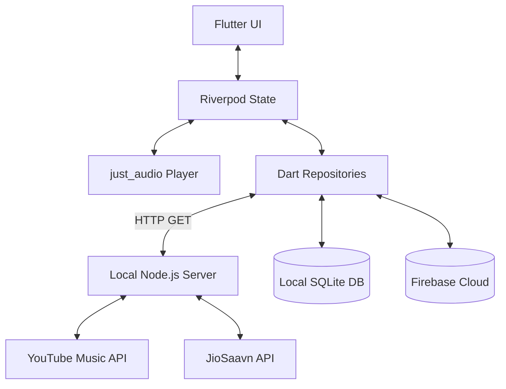

# Aux Music

<div align="center">
  
</div>

<h3 align="center">Free, Unlimited Music and Podcast Streaming. Powered entirely by open sources.</h3>

---

## 📖 Overview
Aux is a modern, privacy-respecting, and completely free music and podcast streaming platform. By combining a beautiful, highly-responsive Flutter frontend with an embedded Node.js backend (BFF), Aux seamlessly aggregates audio content from multiple open sources directly on your device, without requiring an external centralized server.

## 🚨 Problem Statement
In today's digital landscape, users are forced to pay hefty subscriptions for basic features like offline listening, background playback, and ad-free experiences. Furthermore, discovering and sharing music collaboratively in real-time requires all participants to be subscribed to the exact same premium platform, heavily fragmenting the social music experience. 

## 💡 Proposed Solution
Aux solves this by acting as a decentralized aggregator. It embeds a lightweight backend directly onto the user's device that acts as a proxy, fetching metadata and audio streams from open APIs. This allows Aux to provide a premium, ad-free streaming experience with background playback and offline downloads natively. Additionally, Aux introduces a real-time collaborative feature allowing users to sync their queues and listen together regardless of subscriptions.

## ✨ Unique Features
- **Zero Ads, Zero Subscriptions**: 100% free streaming for music and podcasts.
- **Embedded BFF Architecture**: A local Node.js server runs inside the app to securely proxy and scrape audio streams, bypassing the need for a dedicated external cloud server.
- **Pass the Aux**: Real-time collaborative listening. Scan a friend's QR code and instantly sync your current playback queue and current song state across devices.
- **Offline Downloads**: Download your favorite tracks and podcasts directly to your device for offline listening.
- **Universal Search**: Seamlessly search across multiple platforms (YouTube Music, JioSaavn) from a single interface.
- **Beautiful UI**: Fluid animations, a custom audio player, and a sleek dark mode built with Flutter.

## 🏗 Architecture
Aux employs a unique **Backend-For-Frontend (BFF)** architecture that is bundled *inside* the client app using `nodejs-mobile-flutter`.

1. **Client Layer (Flutter)**: Handles UI, state management (Riverpod), and audio playback (`just_audio` & `audio_service`).
2. **Local API Layer (Node.js/Fastify)**: An embedded Node.js process runs on `localhost:3000` on the device. It handles rate-limiting, request deduplication, and parsing complex payloads from YouTube Music.
3. **Data Layer (Drift & Firebase)**: 
    - `Drift` (SQLite) is used for robust local caching and offline track management.
    - `Firebase Firestore` & `Auth` power the real-time social features like "Pass the Aux".

## 🔄 Workflow
1. The user enters a search query in the Flutter app.
2. The Flutter app makes an HTTP GET request to the embedded local Node.js server (`127.0.0.1:3000/search`).
3. The Node.js server fans out the request to various adapter modules (YouTube Music, JioSaavn).
4. The adapters fetch the raw data, parse it, and normalize it into a standard `Track` JSON object.
5. The Node.js server deduplicates the results and returns them to Flutter.
6. When the user taps a track, Flutter requests the audio stream URL from Node.js, which resolves the deciphered audio signature and begins proxying the stream to `just_audio`.

## 🗄 Database Design

### Local SQLite (Drift)
- **TracksTable**: Stores metadata for downloaded and liked tracks (ID, Title, Artist, Album, Duration, Artwork URL).
- **PlaylistsTable**: Stores user-created playlists.
- **PlaylistTracksTable**: A junction table mapping Tracks to Playlists.

### Firebase (Cloud Firestore)
- **Users**: `uid`, `email`, `displayName`, `photoUrl`, `createdAt`.
- **Sessions (Pass the Aux)**: `sessionId`, `hostUid`, `currentTrackId`, `playbackPosition`, `timestamp`, `guests[]`.

## 📊 Diagrams

### System Architecture


## 🛠 Tech Stack Used
- **Frontend Framework**: Flutter (Dart)
- **State Management**: Riverpod (`flutter_riverpod`)
- **Backend / BFF**: Node.js, Fastify, Axios
- **Database (Local)**: Drift (SQLite)
- **Database (Cloud)**: Firebase Auth, Firestore
- **Audio Engine**: `just_audio`, `audio_service`
- **Native Integration**: `nodejs-mobile-flutter`

## 🚀 How to Install & Run

### Prerequisites
- Flutter SDK (`>=3.4.0`)
- Android Studio / Xcode
- Node.js & npm (for local backend development)

### Setup Instructions
1. **Clone the repository:**
   ```bash
   git clone https://github.com/karanks6/Aux-Music.git
   cd Aux-Music/aux_music
   ```

2. **Install Flutter Dependencies:**
   ```bash
   flutter pub get
   ```

3. **Install Node.js Backend Dependencies:**
   Because the backend is bundled via Gradle, ensure you install its dependencies first so the Android build can package them:
   ```bash
   cd nodejs-assets/nodejs-project
   npm install
   cd ../../
   ```

4. **Generate Code (Freezed & Drift):**
   ```bash
   flutter pub run build_runner build --delete-conflicting-outputs
   ```

5. **Run the App:**
   Connect your physical device or start an emulator, then run:
   ```bash
   flutter run
   ```

---
*Disclaimer: Aux is built for educational and research purposes. It relies on third-party APIs which may change without notice. Please respect the terms of service of the respective platforms.*
